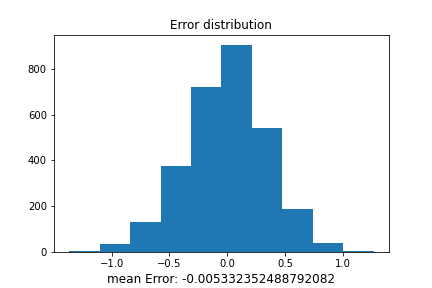

# Project-MAI391 : Return Education

Find out features that effect to wage of a worker.

# Data

There are features description from wage.xlsx:

    1. id                       person identifier
    2. nearc2                   =1 if near 2 yr college, 1966
    3. nearc4                   =1 if near 4 yr college, 1966
    4. educ                     years of schooling, 1976
    5. age                      in years
    6. fatheduc                 father's schooling
    7. motheduc                 mother's schooling
    8. weight                   NLS sampling weight, 1976
    9. momdad14                 =1 if live with mom, dad at 14
    10. sinmom14                 =1 if with single mom at 14
    11. step14                   =1 if with step parent at 14
    12. reg661                   =1 for region 1, 1966
    13. reg662                   =1 for region 2, 1966
    14. reg663                   =1 for region 3, 1966
    15. reg664                   =1 for region 4, 1966
    16. reg665                   =1 for region 5, 1966
    17. reg666                   =1 for region 6, 1966
    18. reg667                   =1 for region 7, 1966
    19. reg668                   =1 for region 8, 1966
    20. reg669                   =1 for region 9, 1966
    21. south66                  =1 if in south in 1966
    22. black                    =1 if black
    23. smsa                     =1 in in SMSA, 1976
    24. south                    =1 if in south, 1976
    25. smsa66                   =1 if in SMSA, 1966
    26. wage                     hourly wage in cents, 1976
    27. enroll                   =1 if enrolled in school, 1976
    28. KWW                      knowledge world of work score
    29. IQ                       IQ score
    30. married                  =1 if married, 1976
    31. libcrd14                 =1 if lib. card in home at 14
    32. exper                    age - educ - 6
    33. lwage                    log(wage)
    34. expersq                  exper^2

# Data Processing

- After remove empty rows and outliers, we analysis the [correlation](./Data/correlation.csv) of these features.

- We plot some [distributions](./Data/raw_distribution/) like below and analysis the linear relation of features:

    

- We calculate the mean and plot [distributions](./Data/raw_distribution/) like below and analysis the linear relation of features:

    

# Training

- Add ones column (bias column) to X and split data to train and test sets

        # Select variables
        datavars = ["educ","exper","expersq","KWW","black","smsa","married","enroll","south",'reg661','reg662','reg663','reg664','reg665','reg666','reg667','reg668']

        data = load_data('../Data/wage_processed_data.dat')

        # Just use some variable in data
        X_data = data[datavars]
        # Add ones to first column of matrix
        X = np.concatenate((np.ones(shape=(data.shape[0],1)) , np.array(X_data)), axis=1)
        # Log wage is the output
        Y = np.array(data["lwage"]).reshape(len(data["lwage"]), 1)
        # Split data to train and test, shuffle the data
        X_train, X_test, Y_train, Y_test = train_test_split(X, Y, test_size = 0.1, shuffle=False)

- Our project uses Linear Regression Model using OLS (Ordinary Least Square) method

        # Calculate inverse of X_T @ X 
        X_TX_inverse = np.linalg.inv(X_train.transpose() @ X_train)
        # Calculate beta
        beta = X_TX_inverse @ X_train.transpose() @ Y_train

        # Use library to calculate beta
        reg = LinearRegression()
        reg.fit(X_train, Y_train)
        beta_ = reg.coef_.transpose()
        beta_[0,0] += reg.intercept_
        print("my beta: \n{0}".format(beta.T))
        print("sklearn beta: \n{0}".format(beta_.T))

- We compare with sklearn library and the results are same:
        
        my beta: 
            [[ 4.86022202e+00  5.32828499e-02  5.62511775e-02 -1.52146205e-03
            7.98181866e-03 -1.24599347e-01  1.37477151e-01  1.40325151e-01
            -1.30659267e-01 -1.36356426e-01 -1.36604992e-01 -3.74880165e-02
            1.25380056e-02 -8.66905816e-02 -4.31047850e-04  4.51402266e-03
            -1.60259327e-03 -1.84796472e-01]]
        
        sklearn beta: 
            [[ 4.86022202e+00  5.32828499e-02  5.62511775e-02 -1.52146205e-03
            7.98181866e-03 -1.24599347e-01  1.37477151e-01  1.40325151e-01
            -1.30659267e-01 -1.36356426e-01 -1.36604992e-01 -3.74880165e-02
            1.25380056e-02 -8.66905816e-02 -4.31047850e-04  4.51402266e-03
            -1.60259327e-03 -1.84796472e-01]]

# Evaluate Model

- We calculate errors and the R-square of train and test data:

        Train error: 0.12520220965397558
        Test error: 0.11695983903492911
        Train R-square: 0.30355029217701957
        Test R-square: 0.3020533950391344

- Plot result around line y = x:

    

- Plot histogram distribution:

    

    

    

# Conclusion

Great! Out predict and the real wage seem be same. 

The mean of error distribution also equal to 0.

However, our model need to be improved because R-square is low.

Our result can help we determine what features effect to wage of a worker (like education,...) and our model can predict approximate values of the wage.

# Collaborators

- Tra Nguyen Huu Nghia (leader)
- Nguyen Minh Nhat
- Vuong Minh Tuan
- Nguyen Huynh Lam
- Do Phu Anh Tai